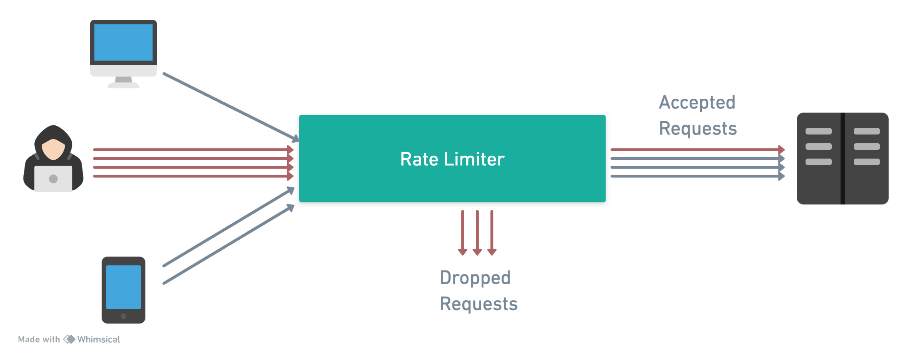
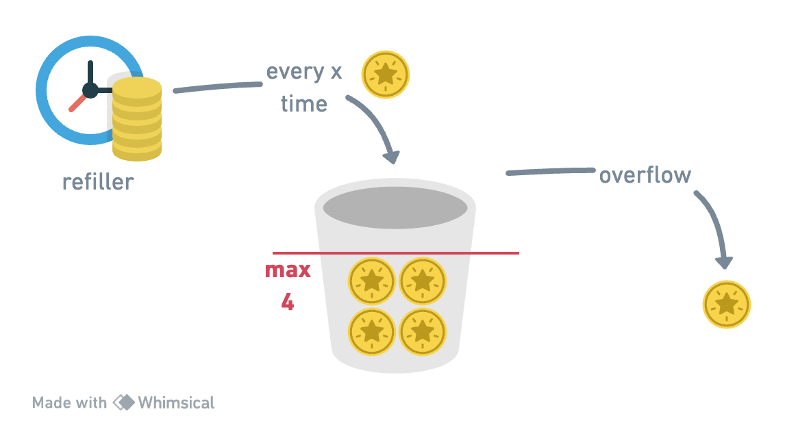

In this blog post, we'll discuss rate limiters, a critical component in distributed systems to
prevent abuse and ensure fair usage of resources. We'll cover the different types of rate
limiters and their implementations in the `minimalist-java` framework, and we'll provide examples of
how to use them with the minimalist-java [http-api](../../../docs/modules/http-api) module.

<!-- truncate -->

---

## Token Bucket



The token bucket algorithm is a simple and efficient way to control the rate of requests to a
resource. It is widely used in network traffic shaping, API rate limiting, and other scenarios where
a controlled flow of requests is required.

The token bucket algorithm is based on the concept of a bucket that holds a fixed number of tokens.

- When a request arrives, the algorithm checks if there are enough tokens in the bucket to serve the
  request.
- If there are enough tokens, the request is served, and the number of tokens in the bucket is
  decremented.
- If there are not enough tokens, the request is rejected.
- Periodically, the bucket is refilled with a fixed number of tokens.
- The bucket has a maximum capacity, and the number of tokens is never greater than the capacity.
- The rate at which the bucket is refilled determines the maximum rate at which requests can be
  served.

Example: `bucketSize = 5`, `refillRate = 1 token/sec`.

- `T0 (01:00:00.000)`: Bucket starts full with 4 tokens.
- `T1 (01:00:01.100)`: 1 request arrives, consumes 1 token, 3 tokens left.
- `T2 (01:00:01.200)`: 3 more requests arrive, consume 3 tokens, bucket empty.
- `T3 (01:00:01.300)`: No tokens, requests dropped. Bucket refills 4 token per second.
- `T4 (01:00:02.000)`: Bucket is refilled with all 5 tokens.
- `T5 (01:00:02.100)`: 1 request arrives, consumes 1 token, 3 tokens left.
- `T6 (01:00:03.000)`: No more requests so far. Bucket is refilled back to 4 tokens (adds 3
  missing ones).

See more details information about the Token Bucket implementation in our
docs [here](../../../docs/modules/http-api/rate-limit/token-bucket).

---

## Leaking Bucket

- Parameters: `bucketSize`, `leakRate`.
- Requests are queued and processed at a fixed rate, smoothing out traffic spikes.
- Excess requests are dropped if the queue is full.
- Example:
    - bucketSize = 4, leakRate = 1 request/2 sec.
      ```
      T0 (01:00:00): Bucket empty, 1 request arrives and enters the queue.
      T1 (01:00:02): 1st request processed (leaked out), 3 more arrive and queue up.
      T2 (01:00:03): Requests arrinving at this time are all dropped, because queue if full.
      T3 (01:00:04): 2nd request processed, 2 in queue, new requests continue to queue if space.
      ```

## Fixed Window Counter

- Parameters: `windowSize`, `maxRequests`.
- Counts requests in fixed time windows; excess requests are dropped once the limit is reached.
- Susceptible to bursts at window boundaries, potentially allowing double the limit across two
  windows.
- Example:
    - windowSize = 1 sec, requestLimit = 3.
      ```
        | 5         X           X       ■ => request allowed
        | 4         X   X       X       X => request dropped
        | 3     ■   ■   ■       ■
        | 2     ■   ■   ■   ■   ■
        | 1     ■   ■   ■   ■   ■
        |_____________________________
        (sec)   1s  2s  3s  4s  5s
      ```

    - A problem with this algorithm is that a burst of traffic at the edges of time
      windows could cause more requests than allowed quota to go through. Consider the following
      case:
      ```
      Requests (excess at the edges of window):
        5         |               |          ■ => request allowed
        4         |           ■   |          X => request dropped
        3         | ■         ■   |           
        2         | ■ ■       ■ X |           
        1         | ■ ■     ■ ■ X |           
        |_________|_______|_______|___________
        00:00   00:30   01:00   01:30   02:00   (min:sec)
                              <---- Window --->
      ```
      In Figure above, the system allows a maximum of 5 requests per minute, and the available
      quota
      resets at the human-friendly round minute. As seen, there are five requests between 00:00
      and 01:00 and five more requests between 01:00 and 02:00. For the one-minute window
      between 00:30 and 01:30, 10 requests go through. That is twice as many as allowed
      requests.

## Sliding Window Log

- Parameter: `capacity`, `threshold`
- Maintains a log of timestamps for each request, providing an exact count within the sliding
  window.
- Enables accurate rate limiting by considering the exact timing of requests.
- Suitable for scenarios where maintaining an accurate request count is crucial.
- Example:
    - windowSize = 1 min, maxRequests = 10.
      ```
      T0 (01:00:00): Window starts, request log is empty.
      T1 (01:00:10): 2 requests arrive, timestamps [01:00:10, 01:00:10] logged.
      T2 (01:00:20): 3 requests arrive, timestamps [01:00:20, 01:00:20, 01:00:20] logged.
      T3 (01:00:30): Window slides, timestamps before 00:59:30 are no longer counted.
      T4 (01:00:40): 2 more requests, timestamps [01:00:40, 01:00:40] added, older timestamps within window considered for count.
      T5 (01:01:00): Window slides, only timestamps after 01:00:00 are counted, older ones are discarded.
      ```

## Sliding Window Counter with Slots

- Parameters: `windowSize`, `maxRequests`.
- Divides the window into smaller slots for a more granular count.
- Slides the window by updating slot counts, allowing a smooth transition and more evenly
  distributed rate limiting.
- Approximates actual sliding window behavior with improved performance.
- Example:
    - windowSize = 1 min, slots = 6 (10 sec/slot), maxRequests = 10.
      ```
      T0 (01:00:00): Window starts, 6 slots initialized with 0 requests.
      T1 (01:00:20): 4 requests arrive, distributed in the first 2 slots.
      T2 (01:00:40): Window slides, first 2 slots cleared, 4 requests in next 2 slots.
      T3 (01:00:50): 3 more requests, fit into the 5th slot, total 7 requests allowed.
      ```

## Approximate Sliding Window Counter

- Parameters: `windowSize`, `maxRequests`.
- Utilizes current and previous window counts with a weighting system based on time elapsed in
  the current window.
- Offers a balance between accuracy and efficiency, smoothing out traffic spikes with minimal
  memory usage.
- Suitable for use cases where an exact count is less critical.
- Example:
    - windowSize = 1 min, maxRequests = 7.
      ```
      T0 (01:00:00): Window starts, 0 requests counted.
      T1 (01:00:30): Previous window had 5 requests, current window has 2.
      T2 (01:00:45): New request evaluated with weighted count: 2 (current) + 5 * 0.75 (previous
      weighted) = 5.75, rounded down to 5, request allowed.
      T3 (01:01:00): Window resets, counting starts afresh for the new minute.

        Requests (weighted from previous window):
        7 |             |                    ■ => request allowed in previous window                                
        6 |             |                    ● => request allowed in current window (weighted from previous window)
        5 |■ ■ ■ ■ ■    |                    + => new request evaluated with weighted count
        4 |             |                    │ => window limit
        3 |             |          
        2 |             |          
        1 |             |● ●       |+
          |_____________|__________|_____________
        01:00       01:00:30   01:00:45   01:01:00   (min:sec)
                  <------ Window ------->
      
      --
       
      At T0 (01:00:00), the window starts with 0 requests counted (│ indicates the window limit, which is 7).
      At T1 (01:00:30), we're in the middle of the current window. The previous window had 5 requests (■), and the current window has 2 requests (●).
      At T2 (01:00:45), a new request arrives (+). The weighted count from the previous window (5 requests at 75% weight) is added to the 2 current requests, resulting in a total of 5.75, which is rounded down to 5. The new request is allowed.
      At T3 (01:01:00), the window resets, and the counting starts afresh for the new minute. All counts from the previous window are no longer applicable. 
      
        Requests (weighted from previous window):
          7 |             |             |           ■ => request allowed in previous window
          6 |             |             |           ● => request allowed in current window
          5 |■ ■ ■ ■ ■    |             |           + => new request evaluated with weighted count
          4 |             |             |           │ => window limit
          3 |             |● ● ●        |           
          2 |             |             |           
          1 |             |             |           
            |_____________|_____________|___________|
          01:00       01:00:30     01:01:00    01:01:30 (min:sec)
                     <---- Rolling Window ------>
      ```

## How to use it with minimalist-java

Use
the [RateLimitFactory](https://github.com/giovannymassuia/minimalist-java/blob/main/modules/http-api/src/main/java/io/giovannymassuia/minimalist/java/lib/ratelimiter/RateLimitFactory.java)
to get a default instance of a rate limiter implementation or to customize the init config.

```java
public class Main {

    public static void main(String[] args) {
        Api.create(8080).rateLimit(
                RateLimitFactory.customFixedWindowCounter(3, Duration.ofSeconds(1)))
            .addRoute(Route.builder("/").path(RouteMethod.GET, "/", ctx ->
                ResponseEntity.ok(Map.of("message", "Hello World!"))
            )).start();
    }

}
```
