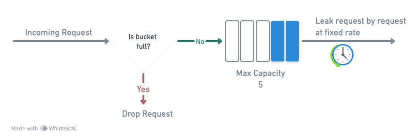

# Leaking Bucket

### Parameters

- `bucketSize`, `leakRate`.

### Description

- Requests are queued and processed at a fixed rate, smoothing out traffic spikes.
- Excess requests are dropped if the queue is full.



Example: `bucketSize = 4`, `leakRate = 1 request/2 sec`.

- `T0 (01:00:00)`: Bucket empty, 1 request arrives and enters the queue.
- `T1 (01:00:02)`: 1st request processed (leaked out), 3 more arrive and queue up.
- `T2 (01:00:03)`: Requests arrinving at this time are all dropped, because queue if full.
- `T3 (01:00:04)`: 2nd request processed, 2 in queue, new requests continue to queue if space.

### How to use

When creating your API, you can use the [RateLimitFactory](#factory) to create a leaking bucket rate limit.

```java showLineNumbers {3}

Api.create(8080)
    .rateLimit(RateLimitFactory.customLeakingBucket(4, Duration.ofSeconds(1)))
    .addRoute(Route.builder("/"),
        .path(RouteMethod.GET, "/", controller::handler))
    .start();

```

### Factory

The [RateLimitFactory](https://github.com/giovannymassuia/minimalist-java/blob/main/modules/http-api/src/main/java/io/giovannymassuia/minimalist/java/lib/ratelimiter/RateLimitFactory.java#L34-L40) provides a `default` and a `custom` method for this rate limiter.

- For more details on the check the source code of the [RateLimitFactory](https://github.com/giovannymassuia/minimalist-java/blob/main/modules/http-api/src/main/java/io/giovannymassuia/minimalist/java/lib/ratelimiter/RateLimitFactory.java#L34-L40)
