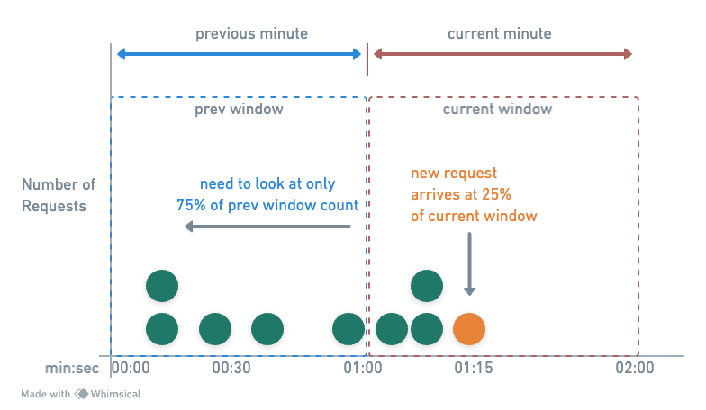

import RateLimitHowToUse from "@site/src/components/rate-limit/RateLimitHowToUse";

# Sliding Window Counter Approximate

### Parameters

- Parameters: `maxRequests`, `windowSize`.

### Description

- Utilizes current and previous window counts with a weighting system based on time elapsed in
the current window.
- Offers a balance between accuracy and efficiency, smoothing out traffic spikes with minimal
memory usage.
- Suitable for use cases where an exact count is less critical.

Example: `windowSize = 1 min`, `requestLimit = 7`

- `T0 (01:00:00)`: Window starts, 0 requests counted.
- `T1 (01:01:10)`: Previous window had 5 requests, current window has 2.
- `T2 (01:01:15)`: New request evaluated with weighted count: `2 (current) + 5 * 0.75 (previous
weighted) = 5.75`, rounded down to `5`, request allowed.
- `T3 (01:02:00)`: Window resets, counting starts afresh for the new minute.

### How to use

<RateLimitHowToUse method="customSlidingWindowCounterApproximate(4, Duration.ofSeconds(1))"/>
