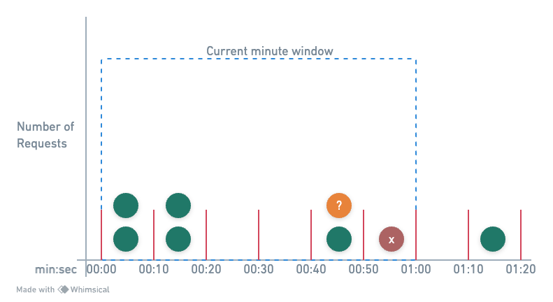

import RateLimitHowToUse from "@site/src/components/rate-limit/RateLimitHowToUse";

# Sliding Window Counter Slots

### Parameters

- Parameters: `maxRequests`, `windowSize`.
- Default: by default the slots size is `6`.

### Description

- Divides the window into smaller slots for a more granular count.
- Slides the window by updating slot counts, allowing a smooth transition and more evenly
distributed rate limiting.
- Approximates actual sliding window behavior with improved performance.

Example: `windowSize = 1 min`, `slots = 6 (10 sec/slot)`, `maxRequests = 10`.

- `T0 (01:00:00)`: Window starts, 6 slots initialized with 0 requests.
- `T1 (01:00:20)`: 4 requests arrive, distributed in the first 2 slots.
- `T2 (01:00:40)`: Window slides, first 2 slots cleared, 4 requests in next 2 slots.
- `T3 (01:00:50)`: 3 more requests, fit into the 5th slot, total 7 requests allowed.

### How to use

<RateLimitHowToUse method="customSlidingWindowCounterSlots(4, Duration.ofSeconds(1))"/>
