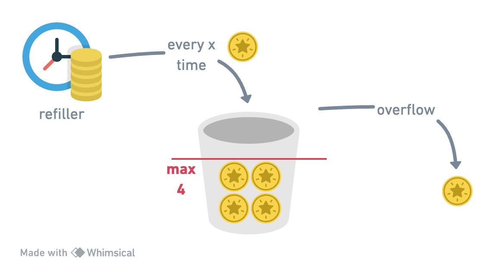

# Token Bucket

### Parameters

- `bucketSize`, `refillRate`.

### Description

- Global bucket limits requests across all users.
- Tokens are consumed per request; when out of tokens, requests are dropped until the next
refill.

<div style={{display: `flex`, justifyContent: `center`}}>
  <div style={{maxWidth: `600px`}}>
    
  </div>
</div>

Example: `bucketSize = 5`, `refillRate = 1 token/sec`.

  - `T0 (01:00:00.000)`: Bucket starts full with 4 tokens.
  - `T1 (01:00:01.100)`: 1 request arrives, consumes 1 token, 3 tokens left.
  - `T2 (01:00:01.200)`: 3 more requests arrive, consume 3 tokens, bucket empty.
  - `T3 (01:00:01.300)`: No tokens, requests dropped. Bucket refills 4 token per second.
  - `T4 (01:00:02.000)`: Bucket is refilled with all 5 tokens.
  - `T5 (01:00:02.100)`: 1 request arrives, consumes 1 token, 3 tokens left.
  - `T6 (01:00:03.000)`: No more requests so far. Bucket is refilled back to 4 tokens (adds 3
missing ones).

### How to use

When creating your API, you can use the [RateLimitFactory](#factory) to create a token bucket rate limit.

```java showLineNumbers {3}

Api.create(8080)
    .rateLimit(RateLimitFactory.customTokenBucket(4, Duration.ofSeconds(1)))
    .addRoute(Route.builder("/"),
        .path(RouteMethod.GET, "/", controller::handler))
    .start();

```

### Factory

The [RateLimitFactory](https://github.com/giovannymassuia/minimalist-java/blob/main/modules/http-api/src/main/java/io/giovannymassuia/minimalist/java/lib/ratelimiter/RateLimitFactory.java#L34-L40)
provides a `default` and a `custom` token bucket rate limit.

- For more details on the check the source code of the [RateLimitFactory](https://github.com/giovannymassuia/minimalist-java/blob/main/modules/http-api/src/main/java/io/giovannymassuia/minimalist/java/lib/ratelimiter/RateLimitFactory.java#L34-L40)
